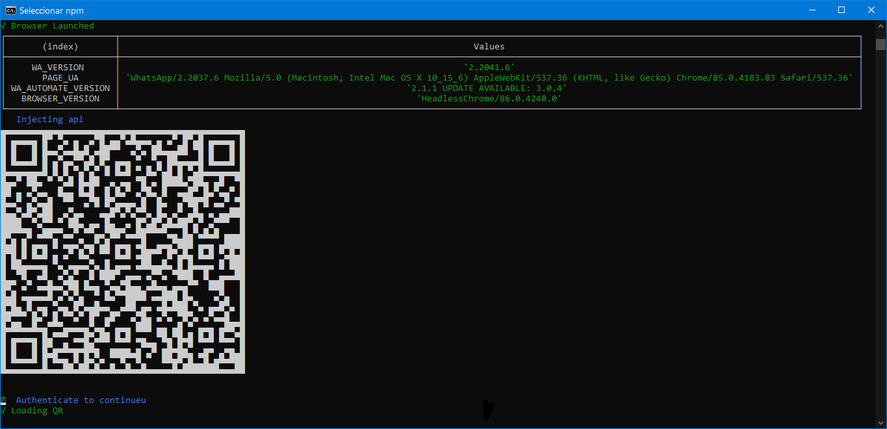
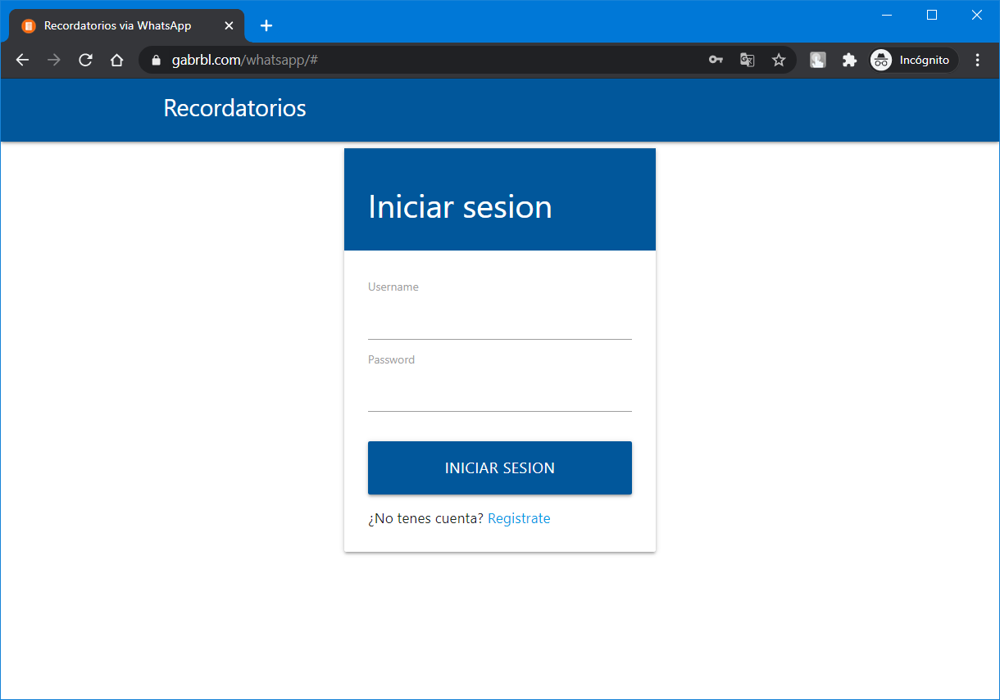
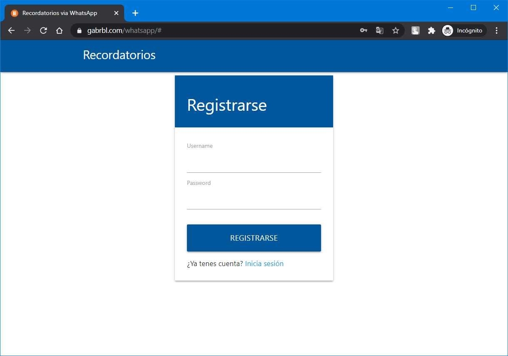
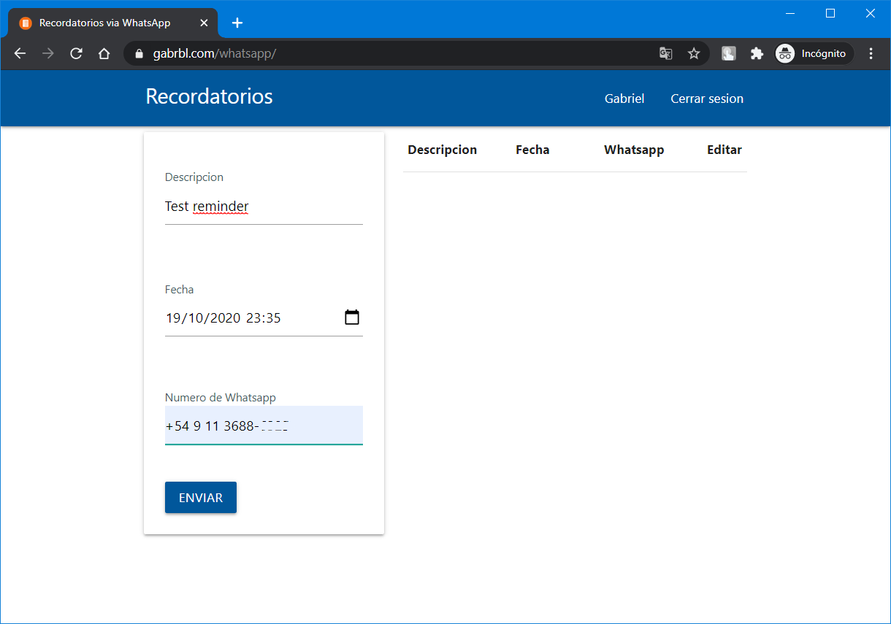
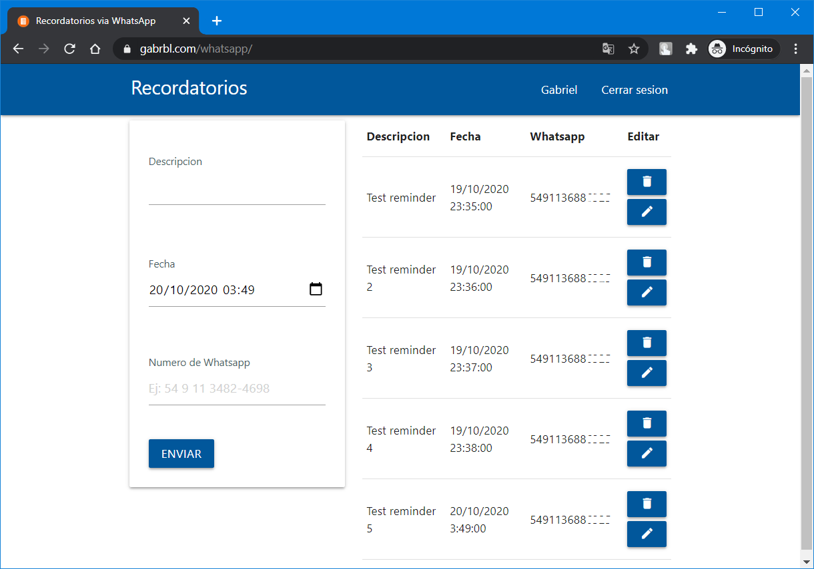
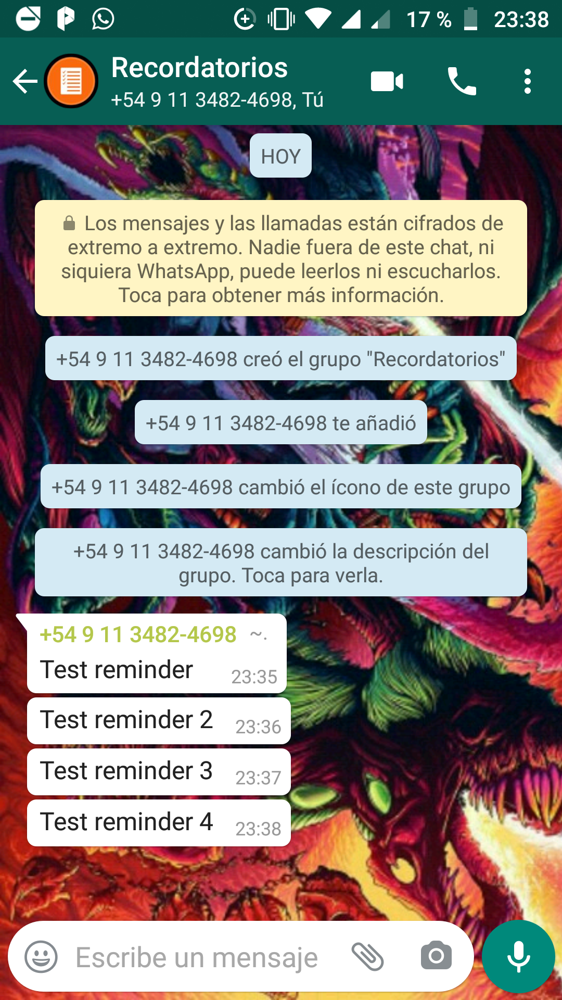

# Whatsapp Reminder Scheduler
Web application for scheduling reminders that alert via WhatsApp messages.
[Visit me](https://www.gabrbl.com/whatsapp/ "Visit me")

## Backend
  - [Node.js](https://nodejs.org/en/)
    - [Express](https://www.npmjs.com/package/express)
    - [Mongoose](https://www.npmjs.com/package/mongoose)
    - [Redis](https://www.npmjs.com/package/redis)
    - [Wa-Automate-Nodejs](https://open-wa.github.io/wa-automate-nodejs/)
    - [JsonWebToken](https://www.npmjs.com/package/jsonwebtoken)
    - [Dotenv](https://www.npmjs.com/package/dotenv)
  - [MongoDB](https://www.mongodb.com/try/download/compass)
  - [Redis](https://redislabs.com/)

## Frontend
  - [React.js](https://reactjs.org/)
  - [Materialize](https://materializecss.com/)
  - [Moment.js](https://www.npmjs.com/package/moment)
  - [Webpack](https://www.npmjs.com/package/webpack)
  - [Babel](https://babeljs.io/docs/en/next/babel-core.html)    

## Requirements
* Create a Mongo and Redis database first.

## Installation
```
git clone https://github.com/GabrielRebelles/RemindersWhatsapp
cd RemindersWhatsapp
npm install 
```

Then create the following environment variables

## Environment Variables
- `PORT` The default port for your server.
- `SecretJWT` Your key to JWT.
- `MongoURI` This is the MongoDB URI.
- `RedisHost` Your Redis host
- `RedisPort` Your Redis port
- `RedisPassword` Your Redis password

## Start the project
1. To start this project run the following code: This will create a WhatsApp web client with puppeteer.

	``
	npm start
	``

2. Scan this QR code with your smartphone


## Screenshots

##### Login

##### Register

##### Main


##### WhatsApp

